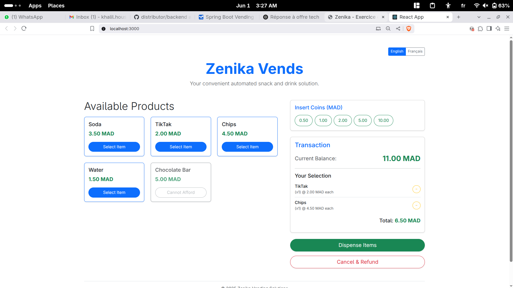
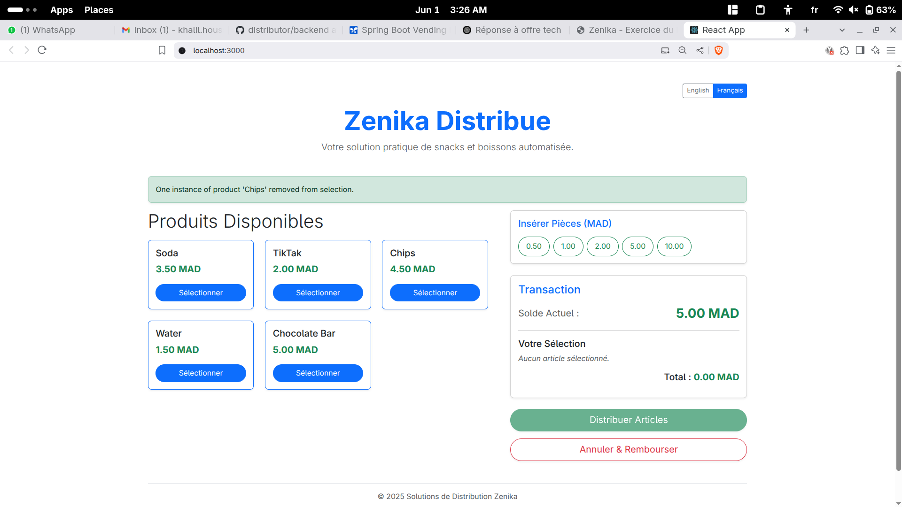
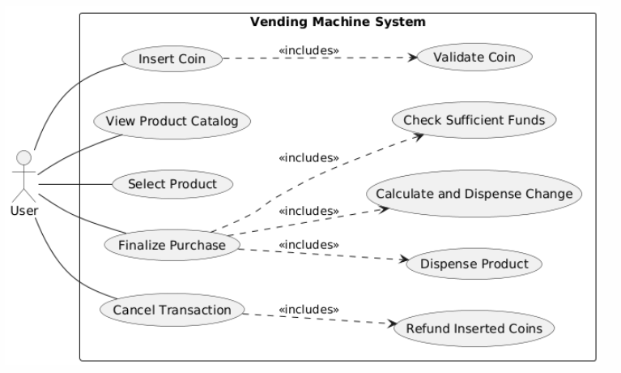
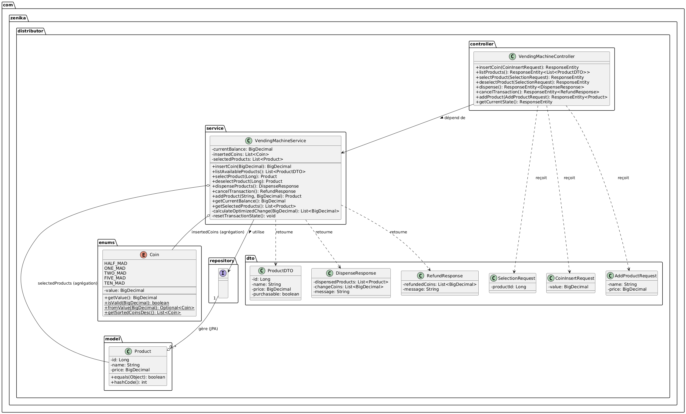
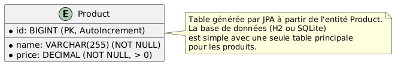

<div align="center">
  <a href="./README.md" style="text-decoration: none;">
    
  </a>
      
  <a href="./README_FR.md" style="text-decoration: none;">
    
  </a>
</div>

---

# Vending Machine API

A modular and testable API for a vending machine, built with Java and Spring Boot , following to modern software architecture and object-oriented design principles. The project also includes a React TypeScript frontend for demonstration with french or english.
<table>
  <tr>
    <td align="center">
      <p><strong>English</strong></p>
      
    </td>
    <td align="center">
      <p><strong>French</strong></p>
      
    </td>
  </tr>
</table>


## you can run the api (backend) without the need to install the code you can just use docker just run this
```bash
docker run -d -p 8080:8080 --name my-vending-api spamfake2022/vending-machine-api:latest
``` 
## Setup and Running the Application using the code

**Prerequisites:**
*   Java JDK 17 or higher
*   Apache Maven 3.6+ (or use the included Maven Wrapper for the backend)
*   Node.js and npm (or yarn) for the frontend

### Backend (Spring Boot API) if you use the docker you dont need this part

1.  **Clone the repository:**
    ```bash
    git clone https://github.com/khalilh2002/distributor
    cd distributor/backend  
    ```
2.  **Build the project:**
    ```bash
    ./mvnw clean package
    ```
3. **Run tests using Maven Wrapper**
    ```bash
    ./mvnw test
    ```
4.  **Run the application:**
    ```bash
    java -jar target/distributor-0.0.1-SNAPSHOT.jar
    ```
    The API will start on `http://localhost:8080`. An H2 database file will be created in `backend/data/`.
    Access H2 console: `http://localhost:8080/h2-console` (JDBC URL: `jdbc:h2:file:./data/vendingmachinedb`).

### Frontend (React UI)

1.  **Navigate to the frontend directory:**
    ```bash
    cd distributor/frontend # Or your UI project directory name
    ```
2.  **Install dependencies:**
    ```bash
    npm install
   
    ```
3.  **Start the development server:**
    ```bash
    npm start
  
    ```
    The React application will typically open on `http://localhost:3000` and connect to the backend API.


## Table of Contents

1.  [Project Overview](#project-overview)
2.  [Core Architectural Concepts](#core-architectural-concepts)
    *   [Usecases](#usecases)
    *   [Key Classes & Domain Model](#key-classes--domain-model)
    *   [Database Design](#database-design)
3.  [Technologies Used](#technologies-used)
4.  [API Endpoints & Demonstration](#api-endpoints--demonstration)
5.  [Setup and Running the Application](#setup-and-running-the-application)
    *   [Backend Spring Boot API](#backend-spring-boot-api)
    *   [Frontend React UI](#frontend-react-ui)
6.  [Running Tests Backend](#running-tests-backend)
7.  [Assumptions & Design Choices](#assumptions--design-choices)

## 1. Project Overview

This project implements a vending machine system with a RESTful API backend and a React frontend. It allows users to perform standard vending machine operations such as inserting coins, selecting products, and receiving items with change.

## 2. Core Architectural Concepts

The system is built upon a layered architecture (Controller, Service, Repository) to ensure a clear separation of concerns.

### Usecases

The primary user interactions with the vending machine are depicted below:



Key usecases include inserting coins, viewing and selecting/deselecting products, dispensing items, and canceling transactions. Administrator functions include adding new products.

### Key Classes & Domain Model

The core components of the backend system and their relationships are illustrated in the class diagram:



*   **`Product` (Entity):** Represents items in the machine (ID, name, price).
*   **`Coin` (Enum):** Defines valid MAD coin denominations.
*   **`VendingMachineService` (Service):** Manages business logic and transactional state (balance, selected items).
*   **`VendingMachineController` (Controller):** Exposes REST API endpoints and delegates to the service.
*   **`ProductRepository` (Repository):** Handles data access for `Product` entities via Spring Data JPA.
*   **DTOs:** Used for API request/response bodies and data transfer (e.g., `ProductDTO`, `SelectionRequest`).
*   **Custom Exceptions & `GlobalExceptionHandler`:** Provide structured error handling and JSON error responses.

### Database Design

The database schema is straightforward, centered around the `Product` entity:



*   **`PRODUCT` Table:** Stores product details (ID, name, price). Managed by JPA/Hibernate.

## 3. Technologies Used

**Backend (Spring Boot API):**
*   Java 17
*   Spring Boot 3.x (as per `pom.xml`)
*   Spring Web, Spring Data JPA, Spring Validation
*   Hibernate 6.x
*   H2 Database Engine (File-based persistent mode)
*   Maven
*   Lombok
*   JUnit 5 & Mockito

**Frontend (React UI):**
*   React
*   TypeScript
*   Axios (for API calls)
*   Bootstrap 5 (for styling)
*   i18next (for internationalization - English & French)

## 4. API Endpoints & Demonstration

All backend API endpoints are prefixed with `/api/distributor`.

---
**POST `/coin`**
*   Description: Inserts a coin.
*   Request Body: `{"value": 5.00}`
*   Example Success Response (200 OK):
    ```json
    {
        "currentBalance": 5.00
    }
    ```
*   Example Error Response (400 Bad Request - Invalid Coin):
    ```json
    {
       "error": "Invalid Coin",
       "message": "Invalid coin value: 5.1. Accepted values: 10.00, 5.00, 2.00, 1.00, 0.50"
   }
    ```

---
**GET `/products`**
*   Description: Lists all products with name, price, and purchasable status.
*   Request Body: _N/A_
*   Example Success Response (200 OK):
    ```json
    [
        {
            "id": 1,
            "name": "Soda Classique",
            "price": 3.50,
            "purchasable": true
        },
        {
            "id": 2,
            "name": "Jus d'Orange Frais",
            "price": 4.00,
            "purchasable": true
        }
    ]
    ```
    *(Purchasability depends on current balance and selected items)*

---
**POST `/select`**
*   Description: Adds one instance of the specified product to the selection.
*   Request Body: `{"productId": 1}`
*   Example Success Response (200 OK):
    ```json
    {
        "message": "Product 'Soda Classique' added to selection.",
        "action": "selected",
        "product": {
            "id": 1,
            "name": "Soda Classique",
            "price": 3.50
        },
        "quantityOfThisProductInSelection": 1,
        "currentSelectedItemsCost": 3.50,
        "currentBalance": 5.00 
    }
    ```
*   Example Error Response (402 Payment Required - Insufficient Funds):
    ```json
    {
        "error": "Insufficient Funds",
        "message": "Insufficient funds to add 'Soda Classique' (3.50). Current selection cost: 2.00. Total needed: 5.50. Balance: 5.00"
    }
    ```

---
**POST `/deselect`**
*   Description: Removes one instance of the specified product from the selection.
*   Request Body: `{"productId": 1}`
*   Example Success Response (200 OK):
    ```json
    {
        "message": "One instance of product 'Soda Classique' removed from selection.",
        "action": "deselected",
        "product": {
            "id": 1,
            "name": "Soda Classique",
            "price": 3.50
        },
        "quantityOfThisProductRemainingInSelection": 0,
        "currentSelectedItemsCost": 0.00,
        "currentBalance": 5.00
    }
    ```
*   Example Error Response (400 Bad Request - Product not in selection):
    ```json
    {
        "message": "Product with ID 1 not found in current selection or does not exist."
    }
    ```

---
**POST `/dispense`**
*   Description: Dispenses selected products if funds are sufficient and returns change.
*   Request Body: _N/A_
*   Example Success Response (200 OK):
    ```json
    {
        "dispensedProducts": [
            {"id": 1, "name": "Soda Classique", "price": 3.50},
            {"id": 3, "name": "Eau Minérale Naturelle", "price": 1.50}
        ],
        "changeCoins": [0.50, 0.50],
        "message": "Products dispensed. Thank you!"
    }
    ```
*   Example Error Response (400 Bad Request - No items selected):
    ```json
    {
        "error": "No Item Selected",
        "message": "No products selected for dispensing."
    }
    ```

---
**POST `/cancel`**
*   Description: Cancels the transaction, refunds inserted coins.
*   Request Body: _N/A_
*   Example Success Response (200 OK):
    ```json
    {
        "refundedCoins": [5.00, 2.00],
        "message": "Transaction cancelled. Coins refunded."
    }
    ```

---
**GET `/state`**
*   Description: Shows current balance, selected items (with quantities), and total selected cost.
*   Request Body: _N/A_
*   Example Success Response (200 OK):
    ```json
    {
        "currentBalance": 7.00,
        "selectedProducts": [
            {
                "id": 1,
                "name": "Soda Classique",
                "price": 3.50,
                "quantity": 2
            }
        ],
        "totalSelectedCost": 7.00
    }
    ```

---
**POST `/admin/product`**
*   Description: (Admin) Adds a new product to the catalog.
*   Request Body: `{"name": "New Energy Drink", "price": "6.00"}`
*   Example Success Response (201 Created):
    ```json
    {
        "id": 9,
        "name": "New Energy Drink",
        "price": 6.00
    }
    ```

---

**General Error Response Format (Example for 404 Not Found):**
```json
{
    "error": "Product Not Found",
    "message": "Product with ID 999 not found."
}
```


## 6. Running Tests (Backend)

The backend project includes unit tests for the core service logic.

*   Navigate to the backend project directory (`distributor/backend`).
*   Run tests using Maven Wrapper:
    ```bash
    ./mvnw test
    ```
Test results are displayed in the console. Reports are in `target/surefire-reports`.
Code coverage (if JaCoCo is configured): `target/site/jacoco/index.html`.

## 7. Assumptions & Design Choices

*   **Unlimited Stock:** Products and change are assumed to be unlimited.
*   **Optimized Change:** A greedy algorithm is used for change.
*   **Single Machine State:** The backend service simulates a single machine state.
*   **MAD Currency:** All monetary values are in Moroccan Dirham.
*   **H2 File Persistence:** The backend uses a local H2 file database for data persistence.
*   **CORS:** Configured to allow requests from `http://localhost:3000` (the default React dev server).
