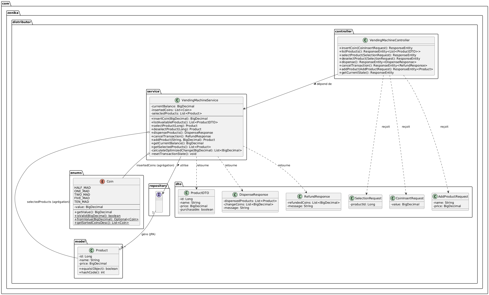

<div align="center">
  <a href="./README.md" style="text-decoration: none;">
    
  </a>
      
  <a href="./README_FR.md" style="text-decoration: none;">
    
  </a>
</div>

---

# API Distributeur Automatique


Une API modulaire et testable pour un distributeur automatique, construite avec Java et Spring Boot, respectant les pratiques modernes d'architecture logicielle et de conception orientée objet. Le projet inclut également une interface utilisateur (frontend) React TypeScript pour la démonstration, disponible en français ou en anglais.

<table>
  <tr>
    <td align="center">
      <p><strong>Anglais</strong></p>
      
    </td>
    <td align="center">
      <p><strong>Français</strong></p>
      
    </td>
  </tr>
</table>

## Vous pouvez exécuter l'API (backend) sans avoir besoin d'installer le code, utilisez simplement Docker en exécutant ceci :
```bash
docker run -d -p 8080:8080 --name my-vending-api spamfake2022/vending-machine-api:latest
``` 

## Installation et Exécution de l'Application en utilisant le code source

**Prérequis :**
*   Java JDK 17 ou supérieur
*   Apache Maven 3.6+ (ou utiliser le Maven Wrapper inclus pour le backend)
*   Node.js et npm (ou yarn) pour le frontend

### Backend (API Spring Boot) si vous utilisez Docker, cette partie n'est pas nécessaire

1.  **Cloner le dépôt :**
    ```bash
    git clone https://github.com/khalilh2002/distributor
    cd distributor/backend  
    ```
2.  **Compiler le projet :**
    ```bash
    ./mvnw clean package
    ```
3.  **Exécuter les tests avec le Maven Wrapper :**
    ```bash
    ./mvnw test
    ```
4.  **Exécuter l'application :**
    ```bash
    java -jar target/distributor-0.0.1-SNAPSHOT.jar
    ```
    L'API démarrera sur `http://localhost:8080`. Un fichier de base de données H2 (`vendingmachinedb.mv.db`) sera créé dans `backend/data/`.
    Accès à la console H2 : `http://localhost:8080/h2-console` (URL JDBC : `jdbc:h2:file:./data/vendingmachinedb`).

### Frontend (UI React)

1.  **Naviguer vers le répertoire frontend :**
    ```bash
    cd distributor/frontend # Ou le nom de votre répertoire UI
    ```
2.  **Installer les dépendances :**
    ```bash
    npm install
    ```
3.  **Démarrer le serveur de développement :**
    ```bash
    npm start
    ```
    L'application React s'ouvrira typiquement sur `http://localhost:3000` et se connectera à l'API backend.

## Table des Matières

1.  [Aperçu du Projet](#aperçu-du-projet)
2.  [Concepts Architecturaux Clés](#concepts-architecturaux-clés)
    *   [Cas d'Utilisation](#cas-dutilisation)
    *   [Classes Clés & Modèle de Domaine](#classes-clés--modèle-de-domaine)
    *   [Conception de la Base de Données](#conception-de-la-base-de-données)
3.  [Technologies Utilisées](#technologies-utilisées)
4.  [Points d'Accès API & Démonstration](#points-daccès-api--démonstration)
5.  [Installation et Exécution de l'Application](#installation-et-exécution-de-lapplication)
    *   [Backend (API Spring Boot)](#backend-api-spring-boot)
    *   [Frontend (UI React)](#frontend-ui-react)
6.  [Exécution des Tests (Backend)](#exécution-des-tests-backend)
7.  [Hypothèses & Choix de Conception](#hypothèses--choix-de-conception)

## 1. Aperçu du Projet

Ce projet implémente un système de distributeur automatique avec un backend API RESTful et un frontend React. Il permet aux utilisateurs d'effectuer les opérations standard d'un distributeur telles que l'insertion de pièces, la sélection de produits, et la réception des articles avec la monnaie.

## 2. Concepts Architecturaux Clés

Le système est construit sur une architecture en couches (Contrôleur, Service, Référentiel) pour assurer une séparation claire des préoccupations.

### Cas d'Utilisation

Les interactions principales de l'utilisateur avec le distributeur automatique sont illustrées ci-dessous :


Les cas d'utilisation clés incluent l'insertion de pièces, la visualisation et la sélection/désélection de produits, la distribution d'articles, et l'annulation de transactions. Les fonctions d'administrateur comprennent l'ajout de nouveaux produits.

### Classes Clés & Modèle de Domaine

Les composants principaux du système backend et leurs relations sont illustrés dans le diagramme de classes :



*   **`Product` (Entité) :** Représente un article disponible dans le distributeur (ID, nom, prix).
*   **`Coin` (Enum) :** Définit les dénominations de pièces valides en MAD.
*   **`VendingMachineService` (Service) :** Gère la logique métier et l'état transactionnel (solde, articles sélectionnés).
*   **`VendingMachineController` (Contrôleur) :** Expose les points d'accès API REST et délègue au service.
*   **`ProductRepository` (Référentiel) :** Gère l'accès aux données pour les entités `Product` via Spring Data JPA.
*   **DTOs (Objets de Transfert de Données) :** Utilisés pour les corps de requête/réponse API et le transfert de données (ex: `ProductDTO`, `SelectionRequest`).
*   **Exceptions Personnalisées & `GlobalExceptionHandler` :** Fournissent une gestion structurée des erreurs et des réponses d'erreur JSON.

### Conception de la Base de Données

Le schéma de la base de données est simple, centré autour de l'entité `Product` :


*   **Table `PRODUCT` :** Stocke les détails des produits (ID, nom, prix). Gérée par JPA/Hibernate.

## 3. Technologies Utilisées

**Backend (API Spring Boot) :**
*   Java 17
*   Spring Boot 3.x (selon `pom.xml`)
*   Spring Web, Spring Data JPA, Spring Validation
*   Hibernate 6.x
*   Moteur de Base de Données H2 (mode persistant sur fichier)
*   Maven
*   Lombok
*   JUnit 5 & Mockito

**Frontend (UI React) :**
*   React
*   TypeScript
*   Axios (pour les appels API)
*   Bootstrap 5 (pour le style)
*   i18next (pour l'internationalisation - Anglais & Français)

## 4. Points d'Accès API & Démonstration

Tous les points d'accès API du backend sont préfixés par `/api/distributor`. L'interface utilisateur frontend interagit avec ces points d'accès.

---
**POST `/coin`**
*   Description : Insère une pièce.
*   Corps de la Requête : `{"value": 5.00}`
*   Exemple de Réponse Succès (200 OK) :
    ```json
    {
        "currentBalance": 5.00
    }
    ```
*   Exemple de Réponse Erreur (400 Bad Request - Pièce Invalide) :
    ```json
    {
        "error": "Invalid Coin",
        "message": "Invalid coin value: 0.3. Accepted values: 10.00, 5.00, 2.00, 1.00, 0.50"
    }
    ```

---
**GET `/products`**
*   Description : Liste tous les produits avec nom, prix, et statut d'achetabilité.
*   Corps de la Requête : _N/A_
*   Exemple de Réponse Succès (200 OK) :
    ```json
    [
        {
            "id": 1,
            "name": "Soda Classique",
            "price": 3.50,
            "purchasable": true
        },
        {
            "id": 2,
            "name": "Jus d'Orange Frais",
            "price": 4.00,
            "purchasable": true
        },
        {
            "id": 3,
            "name": "Eau Minérale Naturelle",
            "price": 1.50,
            "purchasable": false
        }
    ]
    ```
    *(L'achetabilité dépend du solde actuel et des articles sélectionnés)*

---
**POST `/select`**
*   Description : Ajoute une instance du produit spécifié à la sélection.
*   Corps de la Requête : `{"productId": 1}`
*   Exemple de Réponse Succès (200 OK) :
    ```json
    {
        "message": "Product 'Soda Classique' added to selection.",
        "action": "selected",
        "product": {
            "id": 1,
            "name": "Soda Classique",
            "price": 3.50
        },
        "quantityOfThisProductInSelection": 1,
        "currentSelectedItemsCost": 3.50,
        "currentBalance": 5.00
    }
    ```
*   Exemple de Réponse Erreur (402 Payment Required - Fonds Insuffisants) :
    ```json
    {
        "error": "Insufficient Funds",
        "message": "Insufficient funds to add 'Soda Classique' (3.50). Current selection cost: 2.00. Total needed: 5.50. Balance: 5.00"
    }
    ```

---
**POST `/deselect`**
*   Description : Retire une instance du produit spécifié de la sélection.
*   Corps de la Requête : `{"productId": 1}`
*   Exemple de Réponse Succès (200 OK) :
    ```json
    {
        "message": "One instance of product 'Soda Classique' removed from selection.",
        "action": "deselected",
        "product": {
            "id": 1,
            "name": "Soda Classique",
            "price": 3.50
        },
        "quantityOfThisProductRemainingInSelection": 0,
        "currentSelectedItemsCost": 0.00,
        "currentBalance": 5.00
    }
    ```
*   Exemple de Réponse Erreur (400 Bad Request - Produit non sélectionné) :
    ```json
    {
        "message": "Product with ID 1 not found in current selection or does not exist."
    }
    ```

---
**POST `/dispense`**
*   Description : Distribue les produits sélectionnés si les fonds sont suffisants et rend la monnaie.
*   Corps de la Requête : _N/A_
*   Exemple de Réponse Succès (200 OK) :
    ```json
    {
        "dispensedProducts": [
            {"id": 1, "name": "Soda Classique", "price": 3.50},
            {"id": 3, "name": "Eau Minérale Naturelle", "price": 1.50}
        ],
        "changeCoins": [0.50, 0.50],
        "message": "Products dispensed. Thank you!"
    }
    ```
*   Exemple de Réponse Erreur (400 Bad Request - Aucun article sélectionné) :
    ```json
    {
        "error": "No Item Selected",
        "message": "No products selected for dispensing."
    }
    ```

---
**POST `/cancel`**
*   Description : Annule la transaction, rembourse les pièces insérées.
*   Corps de la Requête : _N/A_
*   Exemple de Réponse Succès (200 OK) :
    ```json
    {
        "refundedCoins": [5.00, 2.00],
        "message": "Transaction cancelled. Coins refunded."
    }
    ```

---
**GET `/state`**
*   Description : Affiche le solde actuel, les articles sélectionnés (avec quantités), et le coût total de la sélection.
*   Corps de la Requête : _N/A_
*   Exemple de Réponse Succès (200 OK) :
    ```json
    {
        "currentBalance": 7.00,
        "selectedProducts": [
            {
                "id": 1,
                "name": "Soda Classique",
                "price": 3.50,
                "quantity": 2
            }
        ],
        "totalSelectedCost": 7.00
    }
    ```

---
**POST `/admin/product`**
*   Description : (Admin) Ajoute un nouveau produit au catalogue.
*   Corps de la Requête : `{"name": "Nouvelle Boisson Énergisante", "price": "6.00"}`
*   Exemple de Réponse Succès (201 Created) :
    ```json
    {
        "id": 9,
        "name": "Nouvelle Boisson Énergisante",
        "price": 6.00
    }
    ```

---

**Format Général des Réponses d'Erreur (Exemple pour 404 Non Trouvé) :**
```json
{
    "error": "Product Not Found",
    "message": "Product with ID 999 not found."
}
```

## 5. Installation et Exécution de l'Application

**Prérequis :**
*   Java JDK 17 ou supérieur
*   Apache Maven 3.6+ (ou utiliser le Maven Wrapper inclus pour le backend)
*   Node.js et npm (ou yarn) pour le frontend

### Backend API Spring Boot

1.  **Cloner le dépôt :**
    ```bash
    git clone https://github.com/khalilh2002/distributor
    cd distributor/backend  
    ```
2.  **Compiler le projet :**
    ```bash
    ./mvnw clean package
    ```
3.  **Exécuter l'application :**
    ```bash
    java -jar target/distributor-0.0.1-SNAPSHOT.jar
    ```
    L'API démarrera sur `http://localhost:8080`. Un fichier de base de données H2 (`vendingmachinedb.mv.db`) sera créé dans `backend/data/`.
    Accès à la console H2 : `http://localhost:8080/h2-console` (URL JDBC : `jdbc:h2:file:./data/vendingmachinedb`).

### Frontend UI React

1.  **Naviguer vers le répertoire frontend :**
    ```bash
    cd distributor/frontend 
    ```
2.  **Installer les dépendances :**
    ```bash
    npm install
    ```
3.  **Démarrer le serveur de développement :**
    ```bash
    npm start
    ```
    L'application React s'ouvrira typiquement sur `http://localhost:3000` et se connectera à l'API backend.

## 6. Exécution des Tests Backend

Le projet backend inclut des tests unitaires pour la logique métier principale.

*   Naviguer vers le répertoire du projet backend (`distributor/backend`).
*   Exécuter les tests avec le Maven Wrapper :
    ```bash
    ./mvnw test
    ```
Les résultats des tests sont affichés dans la console. Les rapports détaillés se trouvent dans `target/surefire-reports`.
Rapports de couverture de code (si JaCoCo est configuré) : `target/site/jacoco/index.html`.

## 7. Hypothèses & Choix de Conception

*   **Stock Illimité :** Il est supposé que le distributeur dispose d'un stock illimité de produits et de pièces pour rendre la monnaie.
*   **Rendu de Monnaie Optimisé :** La monnaie est calculée en utilisant un algorithme glouton (plus grosses dénominations en premier).
*   **État Unique de la Machine :** Le service backend simule l'état d'une seule machine physique.
*   **Devise MAD :** Toutes les valeurs monétaires sont en Dirham Marocain (MAD).
*   **Persistance Fichier H2 :** Le backend utilise une base de données H2 locale sur fichier pour la persistance des données.
*   **CORS :** Configuré pour autoriser les requêtes depuis `http://localhost:3000` (serveur de développement React par défaut).
 " ]}
```

